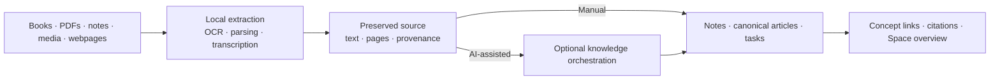
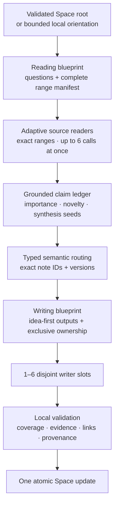
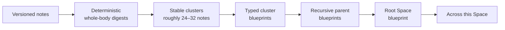

<p align="center">
  
</p>

<h1 align="center">Orion</h1>

<p align="center">
  <strong>Turn source material into a living, linked body of knowledge.</strong>
</p>

<p align="center">
  A local-first knowledge atlas for books, documents, recordings, webpages, and the ideas they become.
</p>

<p align="center">
  <a href="https://github.com/zug11/orion/releases/latest/download/Orion-0.4.1-Apple-Silicon.dmg"><strong>Download for Apple Silicon</strong></a>
  ·
  <a href="#the-orchestration-topology">How it works</a>
  ·
  <a href="#build-from-source">Build from source</a>
  ·
  <a href="#local-first-by-construction">Privacy</a>
</p>

> Orion 0.4.1 runs on Apple Silicon Macs with macOS 13.3 or later. AI is optional: writing, imports, OCR, transcription, links, search, tasks, Spaces, and export remain useful without an API key.

## Knowledge work should produce knowledge, not another inbox

Most note tools leave you with a folder of summaries. Most AI tools flatten a library into one giant prompt.

Orion takes a different approach. It preserves the original source, identifies the durable ideas inside it, and turns those ideas into notes and canonical wiki articles that continue to evolve as new material arrives. Connections are readable hyperlinks—not a graph canvas you have to curate.

The result is a personal wiki that gets more coherent over time:

- **Sources remain sources.** Extracted text, transcripts, provenance, and citations stay available behind the notes they shaped.
- **Ideas define the structure.** One chapter can become several concepts; evidence from distant pages can become one coherent article.
- **Links have destinations.** A durable phrase resolves to one canonical page inside its Space.
- **Notes stay ordinary.** They are permanent, editable, portable Markdown from the moment they are created.
- **Projects stay separate.** Spaces are hard boundaries for notes, sources, concepts, Chat, navigation, and AI context.
- **AI stays optional.** Manual organization and the entire local knowledge layer work without OpenAI or Anthropic.

## From raw material to a personal wiki



Import supports:

| Material | Local preparation |
| --- | --- |
| PDF, DOCX, Markdown, text, HTML, JSON, CSV/TSV | Parsed on-device; healthy PDF text stays on the fast path |
| PNG, JPEG, HEIC, HEIF, scanned PDFs | Recognized on-device with macOS Vision |
| MP3, MP4, M4A, WAV, WebM, OGG, FLAC, MPEG | Decoded with AVFoundation and transcribed with bundled Whisper |
| Public HTTPS webpages | One bounded page fetched through the native host and parsed locally |
| YouTube | One video downloaded with bundled `yt-dlp` + Deno, transcribed locally, then deleted from the temporary folder |
| Pasted text and direct writing | Immediately available without preprocessing |

Choose **Manual** to create one editable note per source without an AI request. Choose **Organize with AI** to turn the material into idea-first notes, reusable concepts, source-backed links, and integrated canonical articles.

## What Orion feels like

### One calm reading and writing surface

There is no Markdown mode and no read/write split. Click **Edit**, write with a lightweight word-processing toolbar, and return to the same page. Headings, tables, task lists, code, quotes, images, links, and numbered source citations remain portable Markdown underneath.

Inline AI writing is deliberately non-destructive. Continue at the caret or select a passage to Rewrite, Clarify, Tighten, Simplify, Expand, or Enrich from the active Space. A proposal is never saved until you accept it, and acceptance is one ordinary Undo step. An OpenAI key also enables selected-passage image generation; image bytes remain transient until accepted.

### A wiki that maintains itself

Teach Orion a phrase once and it becomes durable vocabulary for that Space. Create a blank destination or ask the selected provider to write a focused canonical article. Future occurrences link automatically, while Unlink preserves the words and disables that phrase until it is deliberately taught again.

When a substantive note changes, Orion can refresh the canonical articles genuinely affected by it. Useful new evidence is woven into the existing prose instead of appended as a change log or a stack of source summaries.

### Sources and tasks remain first-class

Every citation opens the preserved source. Every open Markdown task appears on Home with its source note and best matching concept, and it can be completed without entering edit mode. Notes and sources can both be deleted with provenance, link, relationship, and orphan cleanup.

### A Space has memory

Home carries a living **Across this Space** orientation beside the task list. It keeps the last useful overview visible while knowledge changes and falls back to a deterministic local summary when AI is unavailable.

### Your atlas can leave the app

Export the open note, one visible link hop, or an entire Space as:

- a self-contained, responsive HTML article that works offline; or
- portable Markdown files with adjacent image assets.

The web export includes only the selected notes and safe citation attribution. It excludes raw source bodies, Chat, settings, provider keys, import state, and every other Space.

## The orchestration topology

Orion does not ask one model call to read a library, decide what matters, rewrite existing notes, and hope the answer is internally consistent. Long imports run through a host-owned topology with typed artifacts and explicit authority at every transition.



A genuinely short source can still finish in one direct call. The topology exists where it adds coherence; it is not a tax on small imports.

### The reading plan comes before interpretation

The first blueprint receives a complete, immutable source-range manifest and a bounded orientation to the Space. It decides what each section needs to answer before any reader interprets the prose. It cannot invent ranges, drop material, or establish claims about text it has not read.

Readers inherit that shared thesis but receive only their exact source range and explicitly scoped comparison context. Their output separates:

- **source claims**, supported by exact source ranges; and
- **Space-lens interpretations**, supported separately by existing note references.

This prevents a familiar idea from being mistaken for something the imported source actually said.

### Width is adaptive, concurrency is bounded

Initial ranges are derived from page and text density rather than an arbitrary chunk count. If one dense branch is incomplete, Orion narrows only that branch and keeps its successful siblings. Logical reading width may grow; physical provider width never exceeds six concurrent calls.

That distinction matters: difficult material gets a closer reading without turning one malformed response into an unbounded agent tree or a storm of duplicate requests.

### Claims become knowledge objects, not chunk summaries

Each reader returns atomic claims and importance-ranked synthesis seeds. A seed proposes a durable object with a semantic title, thesis, exact supporting claims, and a typed contribution to the Space: `new`, `extends`, `contradicts`, `connects`, or `qualifies`.

The writing blueprint must account for every seed as a primary output, a justified merge, or an explicit low-value omission. Adjacent passages can split when they express different ideas; distant passages can combine when they establish one thesis. Note boundaries follow meaning, not files, pages, chapters, or worker assignments.

### Typed routing is a capability boundary

After the source has been read, Orion contracts a small existing-note candidate universe locally. A typed router classifies each exact note version as:

`unrelated` · `duplicate` · `extends` · `contradicts` · `uncertain`

Coverage must be exact: missing, duplicated, extra, stale, substituted, or cross-Space entries invalidate the result. Routing grants read eligibility, not write authority. A full note body can be opened only through an allowed route; revising it additionally requires one exclusive writer to own that exact frozen version.

### The host has the final say

There is no final model call that rewrites all accepted prose. Orion locally validates source coverage, claim support, note versions, destination ownership, citations, links, concepts, tasks, provenance, and aggregate limits. Only then does it apply the complete result atomically.

No provider call occurs after local assembly begins.

## Persistent Space memory

Large Spaces should not be reread from raw note bodies before every import or enrichment. Orion maintains a replaceable semantic hierarchy keyed by exact content fingerprints:



Every level keeps stable downward references to the exact note versions beneath it. A changed note invalidates its digest and affected ancestors, then Orion refreshes that path sequentially. Unchanged clusters are not reread, and the last valid root remains usable while maintenance runs.

This hierarchy is orientation and routing memory—not a substitute for evidence. When exact facts matter, Orion follows the references back down to the underlying note or source.

If existing-note AI context is disabled, the hierarchy may still exist locally for fingerprints, search, and collision safety, but none of its blueprints, digests, routing signals, or note-derived content is sent to a provider.

## Recovery without hand-waving

Long-running knowledge work fails in more interesting ways than a simple retry button suggests. Orion contains failure at the smallest safe scope:

- A dense or contract-invalid source branch can receive a closer read without repeating successful siblings.
- A malformed multi-output writing slot can narrow while completed disjoint slots remain accepted.
- Provider-wide authentication, billing, availability, rate-limit, or timeout failures do not trigger recursive subdivision.
- Versioned session checkpoints retain accepted readings, routes, plans, and drafts so a safe resume calls only unfinished work.
- Changed source text, Space state, model, or guidance invalidates the checkpoint instead of applying stale work.
- If structured synthesis cannot finish safely, Orion preserves the complete source and lands an honest editable note instead of disguising partial orchestration as success.
- Nothing partially mutates the Space: local validation and atomic application remain the final barrier.

The result is an orchestration system whose useful parallelism is bounded, whose state is replayable, and whose failures do not silently widen authority.

## Local-first by construction

Local-first does not mean pretending network AI is local. Orion makes the boundary explicit.

| Data or operation | Where it happens |
| --- | --- |
| Notes, concepts, relationships, sources, Chat history | Plaintext `vault.json` in Orion's local application-data folder |
| Provider credentials | OS credential store; never written to the vault or returned to the renderer |
| Text/PDF/DOCX parsing | On-device |
| Image and scanned-PDF OCR | On-device through the macOS Vision framework |
| Media transcription | On-device with bundled Whisper and AVFoundation |
| YouTube media | Temporary local download, deleted after transcription or failure |
| Manual import, editing, search, links, tasks, export | Local; no provider key required |
| AI organization and writing | Bounded declared context sent to the selected OpenAI or Anthropic model |
| OpenAI organization | Responses API with `store: false`; account-level provider policies still apply |
| Claude/Codex connector | Local MCP process with bounded Space-scoped reads and explicit-Space writes |

The renderer's desktop CSP blocks arbitrary network access. Native commands validate their inputs and own provider calls, public-web fetching, file writes, credentials, OCR, transcription, and export.

Orion has no sync service, collaboration server, telemetry integration, OCR service, or transcription service. The vault is not currently encrypted, and exported files are ordinary unencrypted snapshots. Review important AI-generated claims before relying on them.

## Codex and Claude can work inside Orion

Orion bundles the same local, read-write MCP server in two zero-configuration integrations:

- **Codex:** open **Settings → Connections → Install in Codex**, then confirm installation on Orion's plugin page.
- **Claude Desktop:** open **Settings → Connections → Install in Claude**, then accept the bundled extension prompt.

Both integrations discover Spaces, search and browse bounded content, open exact notes and sources, return `orion://` citations, and create, update, or delete ordinary notes. Reads default only to the active Space. Every write requires an explicit exact Space ID.

The connector rereads the real vault for every call, shares Orion's advisory lock and atomic replacement protocol, makes no network request of its own, and cannot read either provider key. Text deliberately returned to Codex or Claude is then governed by that product's account settings.

## Download

[**Download Orion 0.4.1 for Apple Silicon**](https://github.com/zug11/orion/releases/latest/download/Orion-0.4.1-Apple-Silicon.dmg)

Requirements:

- Apple Silicon Mac
- macOS 13.3 or later
- An OpenAI or Anthropic API key only for optional AI features

The release bundle is self-contained. It includes the Vision OCR helper, Whisper model and runtime, `yt-dlp`, Deno, Claude connector, and Codex plugin. No Homebrew package, Python environment, ffmpeg installation, local model server, or transcription API key is required.

## Build from source

### Prerequisites

- [Git LFS](https://git-lfs.com/) 3.x
- Node.js `^20.19.0`, `^22.12.0`, or `>=24.0.0`, with npm
- A stable Rust toolchain with Cargo
- Xcode Command Line Tools or Xcode
- Apple Silicon macOS 13.3 or later for the bundled native runtime

### Run the desktop app

```bash
git lfs install
git lfs pull
npm ci
npm run tauri dev
```

The first Rust build is substantial because Tauri and native dependencies compile from a clean target directory.

### Run the browser preview

```bash
npm ci
npm run dev
```

Browser preview is a renderer-development convenience, not Orion's desktop security model. It uses `localStorage`, keeps entered provider keys in memory for the current tab, and cannot run native Vision OCR, offline transcription, YouTube import, native export, or Keychain-backed credential storage.

### Useful commands

| Command | Purpose |
| --- | --- |
| `npm run check` | Run renderer tests, type-check, and create a production renderer build |
| `npm run tauri dev` | Run the complete desktop application |
| `npm run tauri build` | Perform the canonical native integration build |
| `npm run build:mcp` | Build, package, sign, and protocol-test the Claude connector |
| `npm run build:codex` | Stage and contract-test the Codex plugin |
| `npm run build:desktop` | Build native helpers, renderer, MCP connector, and Codex plugin in dependency order |
| `cargo test --manifest-path src-tauri/Cargo.toml` | Run Rust host tests |
| `cargo test --manifest-path src-tauri/mcp-server/Cargo.toml` | Run MCP server tests |

Native bundles are written below `src-tauri/target/release/bundle/`. Public release packaging additionally requires Developer ID signing and notarization; use `./script/package_release.sh <release-label>` rather than treating a local ad-hoc build as a distributable release.

## Architecture

| Layer | Responsibilities |
| --- | --- |
| React 19 + TypeScript + Vite | Workspace, editor, import queue, search, navigation, Chat, export composition |
| Tiptap 3 | Direct rich-text editing with portable Markdown persistence |
| Tauri 2 + Rust | Atomic vault persistence, Keychain access, provider calls, native dialogs, bounded webpage fetches, attachments, export |
| pdf.js + Mammoth | Local PDF and DOCX extraction |
| macOS Vision sidecar | Selective image and scanned-page OCR |
| AVFoundation + whisper.cpp | Local media decoding and transcription |
| Independent Rust MCP server | Lock-safe, Space-scoped Codex and Claude tools |
| Vitest + Rust tests + protocol harnesses | Renderer behavior, trust boundaries, schemas, packaging, citations, and cross-Space isolation |

### Vault

The canonical desktop vault is:

```text
~/Library/Application Support/app.orion.knowledge/vault.json
```

It is schema-versioned and stores all Spaces in one snapshot. Saves are serialized, flushed to a temporary file, and atomically replaced. Orion and its MCP server coordinate through a sibling advisory lock and revision checks so an external agent write cannot be silently overwritten by stale renderer state.

An invalid or unsupported vault opens a recovery screen; Orion never silently replaces it with an empty library. A fresh installation starts completely empty—no sample notes, sources, or conversations are seeded.

## Repository map

```text
src/
  App.tsx                         Space and vault orchestration
  components/                    editor, import, Chat, Home, sources, navigation
  lib/knowledgeOrchestration/    typed plans, readers, routing, writers, recovery
  lib/spaceKnowledge.ts          persistent digests and Space hierarchy
  lib/files.ts                   local source extraction
  lib/wiki.ts                    canonical links, references, and backlinks
  lib/storage.ts                 validated IPC and browser fallback
  lib/webExport.tsx              scoped offline HTML export

src-tauri/
  src/lib.rs                     native host and trust boundaries
  mcp-server/                    independent local read-write MCP server
  native/                        Vision OCR and Whisper sidecar sources
  binaries/                      bundled native executables
  resources/                     model, connectors, notices, and licenses

codex/orion/                     canonical Codex plugin source
mcp/orion-claude/                Claude extension manifest and documentation
script/                          native, connector, verification, and release tooling
```

## Verification

The normal handoff suite is:

```bash
npm run check
cargo test --manifest-path src-tauri/Cargo.toml
cargo test --manifest-path src-tauri/mcp-server/Cargo.toml
cargo fmt --manifest-path src-tauri/Cargo.toml -- --check
cargo fmt --manifest-path src-tauri/mcp-server/Cargo.toml -- --check
```

For native or release changes, also run `npm run tauri build`. Connector builds run lifecycle, schema, citation, read/write, and Space-isolation harnesses against the exact packaged binaries.

Contributors should read [AGENTS.md](AGENTS.md) before changing Orion. It is the durable product and engineering contract for persistence, privacy, orchestration, links, connectors, native packaging, and release safety. Deferred product directions live in [ROADMAP.md](ROADMAP.md), and bundled dependency attributions live in [THIRD_PARTY_NOTICES.md](src-tauri/resources/THIRD_PARTY_NOTICES.md).

---

<p align="center">
  <strong>Orion turns a collection of material into a place you can think.</strong>
</p>
