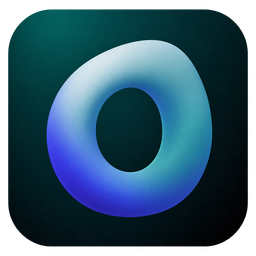
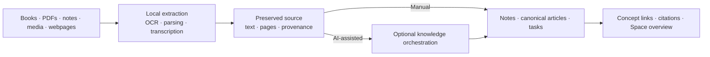
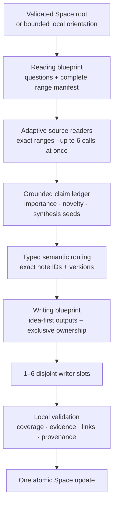
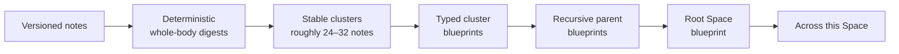

<p align="center">
  
</p>

<h1 align="center">Orion</h1>

<p align="center">
  <strong>Turn source material into a living, linked body of knowledge.</strong>
</p>

<p align="center">
  A local-first knowledge atlas for books, documents, recordings, webpages, and the ideas they become.
</p>

<p align="center">
  <a href="https://github.com/zug11/orion/releases/latest/download/Orion-0.4.7-Apple-Silicon.dmg"><strong>Download for Apple Silicon</strong></a>
  ·
  <a href="https://github.com/zug11/orion/releases/latest/download/Orion-0.4.7.m-Apple-Silicon.dmg">Whisper Medium edition</a>
  ·
  <a href="#the-orchestration-topology">How it works</a>
  ·
  <a href="#build-from-source">Build from source</a>
  ·
  <a href="#local-first-by-construction">Privacy</a>
</p>

> Orion 0.4.7 runs on Apple Silicon Macs with macOS 13.3 or later. AI is optional: writing, imports, OCR, transcription, links, search, tasks, Spaces, and export remain useful without an API key.

## Knowledge work should produce knowledge, not another inbox

Most note tools leave you with a folder of summaries. Most AI tools flatten a library into one giant prompt.

Orion takes a different approach. It preserves the original source, identifies the durable ideas inside it, and turns those ideas into notes and canonical wiki articles that continue to evolve as new material arrives. Connections are readable hyperlinks—not a graph canvas you have to curate.

The result is a personal wiki that gets more coherent over time:

- **Sources remain sources.** Extracted text, transcripts, provenance, and citations stay available behind the notes they shaped.
- **Ideas define the structure.** One chapter can become several concepts; evidence from distant pages can become one coherent article.
- **Links have destinations.** A durable phrase resolves to one canonical page inside its Space.
- **Notes stay ordinary.** They are permanent, editable, portable Markdown from the moment they are created.
- **Projects stay separate.** Spaces are hard boundaries for notes, sources, concepts, Chat, navigation, and AI context.
- **Chat reads as it goes.** Chat uses the Space hierarchy and compact note directories to find promising material, searches note and source bodies, then opens exact passages and follows connections as needed. Replies can cite the passages actually read; click a citation to inspect it or open the original item. Reading is bounded, can be stopped, and reports partial coverage. Chat can create notes only when explicitly asked. Created notes and **Keep as note** retain exact quoted passages and source links, including when an original later changes or is removed. This uses the selected OpenAI or Anthropic model and may make several requests for a question.
- **Search reaches the original text.** Search finds phrases and relevant combinations of words throughout note bodies and preserved sources. Filter Notes, Sources, or Concepts, see highlighted matches, and jump to the passage. Choose **Ask AI** at the right of the search field for a cited answer from the current Space. Switch between Matches and Answer without repeating the request; ordinary search stays local and works without a key.
- **AI stays optional.** Manual organization and the entire local knowledge layer work without OpenAI or Anthropic.

## From raw material to a personal wiki


```mermaid
flowchart LR
    A["Books · PDFs · notes · media · webpages"]
    B["Local extraction<br/>OCR · parsing · transcription"]
    C["Preserved source<br/>text · pages · provenance"]
    D["Optional knowledge orchestration"]
    E["Notes · canonical articles · tasks"]
    F["Concept links · citations · Space overview"]

    A --> B --> C
    C -->|Manual| E
    C -->|AI-assisted| D --> E --> F
```

Import supports:

| Material | Local preparation |
| --- | --- |
| PDF, DOCX, Markdown, text, HTML, JSON, CSV/TSV | Parsed on-device; healthy PDF text stays on the fast path |
| PNG, JPEG, HEIC, HEIF, scanned PDFs | Recognized on-device with macOS Vision |
| MP3, MP4, M4A, WAV, WebM, OGG, FLAC, MPEG | Decoded with AVFoundation and transcribed with the edition's bundled multilingual Whisper model |
| Public HTTPS webpages | One bounded page fetched through the native host and parsed locally |
| YouTube | One video downloaded with bundled `yt-dlp` + Deno, transcribed locally, then deleted from the temporary folder |
| Pasted text and direct writing | Immediately available without preprocessing |

Choose **Manual** to create one editable note per source without an AI request. Choose **Organize with AI** to turn the material into idea-first notes, reusable concepts, source-backed links, and integrated canonical articles.

Media imports can be cancelled by removing the queued input. If one file fails,
completed siblings remain available and Orion reports each failure. Long media
is decoded in bounded overlapping windows with one loaded Whisper model.
Downloads have a 20-minute limit, transcription has a 60-minute limit, and each
request has a 90-minute total limit. Inputs are limited to 2 GiB and 12 hours of
decoded audio; longer material can be split into separate files.

**Settings → Intelligence** includes **GPT-6 Astra** for complex research and
synthesis through your OpenAI connection, with Low through Extra high reasoning.

## Orion 0.4.7

Version 0.4.7 packages the current editor, search, export and appearance work in
both Whisper Small and Medium editions. The editor toolbar has a consistent
frosted native glass surface, with spacing between control groups instead of
vertical dividing lines. See [the 0.4.7 release notes](releases/0.4.7.md) for
the included changes and verification details. Both installers are Developer ID
signed, Apple notarized and stapled, and pass Gatekeeper.

## Writing and narration in 0.4.6

Orion 0.4.6 includes a compact slash menu, precise linked excerpts, Word-style
table insertion with Pages-style document controls, freely movable images with
live text wrapping, a contextual toolbar, and Heading 1–6. Both the Small and
Medium editions include these features.

Written-note Play adds **Follow text**: upcoming words dim,
the current word is highlighted, and clicking text jumps to that passage. Pause
and resume retain your place; the playback slider supports arrow keys, Home and
End. System voices use their word-boundary events, ElevenLabs supplies timing
with its audio, and OpenAI audio is aligned locally using bundled Whisper.
If a voice or alignment cannot provide word timing, playback remains available
with a visible **Passage timing** fallback. Cloud passages are prepared as needed
and cached for seeking; local alignment adds preparation time to OpenAI playback.
No original dictation recordings are retained by this feature.

Orion 0.4.7 also brightens every word before a new seek position
immediately, leaving only upcoming words dim. **Download narration** saves the
whole written note as audio: Mac system voices produce a local AIFF; OpenAI and
ElevenLabs produce a WAV and reuse already prepared passages. Missing cloud
passages use the selected provider normally. Downloads are cancellable and
bounded to 80,000 characters and 128 MiB of audio, with a clear error instead of
truncation. These follow-up changes are included in the 0.4.7 installers.

The Space switcher now has a pencil action to rename a Space. Import knowledge
uses larger supporting text, and the editor has a clearer standalone sparkle
icon for **AI tools**, covering writing, rewriting and image generation. Its
accessible name and tooltip explain the action without adding toolbar text.

The toolbar keeps its original width, with contextual More at the far right and
lower-priority tools moving into that menu as space narrows. Slash choices stay
below the caret in a scrollable menu. Tables use edge count controls with
chevrons and protect nonempty content when reducing rows or columns. Excerpts
share a quiet left rule and small bottom-right attribution in reading/editing.
Opening the text-formatting **…** menu with the mouse leaves Text style
unhighlighted until you interact with it. Keyboard opening focuses the first
control; arrow keys navigate the menu and Escape returns to **…**, preserving
the selected passage.

The current development toolbar promotes row/column insertion and deletion,
header and alternating-row controls to icons with hover labels. **Justify text**
(Cmd+Shift+J, or More in a narrow toolbar) formats the selected paragraphs and
survives reopening, reading and offline HTML export. Click it again to restore
left alignment. Lists retain one interactive checkbox per task. The table width
control shows its percentage directly, with no decorative icon beside it.

Each note remembers whether you left it in edit or preview mode during the
current window session. Returning to it restores that mode; **Done** leaves it
in preview. Note actions sit above the title and subtitle, which stay together
without a divider or concept/source statistics below them. The formatting
toolbar sits below the heading and groups controls with spacing instead of
vertical dividers. Active controls retain their outlines. It becomes
sticky only when scrolling takes it to the top of the writing pane. Entering edit
mode places the caret in text without automatically selecting an opening photo
or scrolling the note.

**Margins** in the toolbar (or **…** at narrow widths) toggles a horizontal ruler
directly below it, pinned together with the toolbar. On macOS 26 and later the
toolbar and **More** menu use the same native Regular Liquid Glass treatment,
while the ruler keeps the more
transparent Clear glass with no added frosting. Their materials stay independent
while their native surfaces move together. **More** opens on its own native
Regular glass surface and keeps the toolbar and ruler glass visible beneath it.
All three follow the Mac's Liquid Glass
appearance preference; maximum system tint makes even Clear glass more opaque.
The writing pane stops at its scroll
boundaries without elastic overscroll while editing.
Older systems, browser preview and accessibility modes use a solid surface.
Drag its left and right markers independently
to reflow the text immediately. With no passage highlighted, the ruler changes
the document body's margins. Highlight text to adjust only the selected
paragraphs or headings, including prose in lists and quotes; tables
and code keep their own layout. Each side runs from 0–25% of the available
writing width, without creating a special block.
The ruler follows your current selection while it remains visible. Rapid drag
adjustments keep the latest margin and selected passage as the app saves them.
Its markers
also support arrow keys, with Shift for larger steps. The small reset icon below
the ruler on the right clears margins for the current scope; click **Margins**
again to hide the ruler. Undo restores each completed drag independently. Margins
survive saving, reopening, reading, Markdown round trips, offline HTML export
and Word export.

**Block controls**, shown by three small rectangles inside **…**, optionally
groups the current paragraph, heading, list, table, image, quote, excerpt or
selected passage into a persistent block. Blocks and ordinary prose share the
same note. Clicking outside a block returns to normal writing without removing
the block; clicking back inside restores its controls. Use Block controls again
to remove the grouping while keeping its content. The `/block` slash command
also creates a block.

Press Enter in a block's paragraph or heading to continue in a new block. Use
Shift+Enter for a line break inside the same block. Lists, tables, code and quotes
keep their usual Enter behavior; Enter outside blocks continues ordinary prose.

Blocks have no visible box or decorative corners. Small plus controls just above
and below the active block insert another block with the same choices as slash.
The hamburger, upper plus and trash sit on one line above the block, clear of
table selection controls. The trash action deletes that block, and the hamburger
on the left lets you drag it to a new position or move it with the Up/Down arrow
keys. The small controls
have larger invisible click areas. Wrapping, unwrapping,
deleting and moving each support Undo. Normal writing can continue below the last
block, and images keep their free placement and text wrapping.

Block grouping survives saving and reopening through bounded Markdown comment
wrappers; reading and offline HTML hide those markers. This remains one document
format and does not introduce an application-wide preference. Text style/Header
choices are in **…**. In a narrow image toolbar, alignment and width also move
into **…**, while placement stays directly available.

Images can be dragged continuously within the writing column, staying at their
displayed size without a separate destination box or position label. Captions
move with the image, and the surrounding text wraps live. An internal paragraph
anchor and bounded free offsets preserve placement; Wrap text uses the roomier
side, and Above & below reserves the full line across the image's height.
Excerpts preserve editable quoted words and do
not synchronise subsequent source edits. See [the editor and narration guide](docs/editor-preview.md)
for interactions, persistence, limitations and historical preview validation.

## What Orion feels like

### One calm reading and writing surface

There is no Markdown mode and no read/write split. Click **Edit**, write with a lightweight word-processing toolbar, and return to the same page. Headings, tables, task lists, code, quotes, images, links, and numbered source citations remain portable Markdown underneath.

While editing a note, the microphone in the sticky writing toolbar records dictation and inserts the transcript at the preserved text cursor. The control remains available as the note scrolls. Recording and transcription stay on-device; the temporary M4A is deleted when bundled Whisper finishes.

The ordinary `0.4.7` download bundles Whisper Small and processes two-minute segments. The `0.4.7.m` download bundles Whisper Medium, loads it once per dictation, and transcribes overlapping 30-second windows in the background. Both keep all generated text hidden until you press Stop, and neither imposes a fixed recording-duration cap.

Inline AI writing is deliberately non-destructive. Continue at the caret or select a passage to Rewrite, Clarify, Tighten, Simplify, Expand, or Enrich from the active Space. A proposal is never saved until you accept it, and acceptance is one ordinary Undo step. An OpenAI key also enables selected-passage image generation. Choose **Fast** (Flare) or **Detailed** (Sunburst); image bytes remain transient until accepted.

Illustrations can use **Selection only** or **Related Space**, independently of image quality. Related Space searches for relevant passages, reads independent questions in parallel, follows important gaps and compresses the findings into a grounded visual brief. It adapts to useful evidence rather than reading a fixed quota of notes. Selection only sends the highlighted passage and your optional direction; it excludes the note title and surrounding Space material. The initial choice follows your existing AI-context setting, and you can override it for one image.

Research uses your selected Intelligence model with Low reasoning; the final brief uses your selected reasoning effort. Planning needs that provider's key; rendering needs an OpenAI key. Progress names the current stage, limited coverage is disclosed, and Retry preserves completed research and the brief. If insertion fails, Retry restores the downloaded image without generating it again. Scope or supporting-evidence changes invalidate stale work; unrelated note edits do not restart it. No notes are changed during planning. See [adaptive image context](docs/adaptive-image-context.md) for boundaries and recovery details.

**New note** still opens a blank page. When a key is configured for your selected AI provider, the chevron next to it opens **Generate**: a note, a podcast script, a slide deck, or a slide deck written to be heard. The chevron stays hidden without that key. Each result lands as an ordinary note. Generated articles receive an AI-written title alongside their body; a title you edit during generation is preserved. **Play** in the note header reads the open page with System speech, OpenAI `gpt-4o-mini-tts`, or an optional ElevenLabs key. Slide decks generate complete `gpt-image-2.5-sunburst` slides that letter the title and bullets in distinctive fonts, hide speaker notes on screen, and Play times those slides to the narration.

Image generation keeps medium-quality JPEG output. OpenAI's [Image API](https://developers.openai.com/api/reference/resources/images/methods/generate) does not document a Fast mode option; [Fast mode](https://developers.openai.com/api/docs/guides/fast-mode) is documented for Responses and Chat Completions.

Generate shows **Use notes from this Space**, initially matching your context setting. Turn it on for a single generation without changing that setting. Authored notes provide context even without imported Sources: Orion uses the Space overview, a compact note directory, and relevant note excerpts. Decks and podcasts share one outline before up to six writers work on separate sections; slide images follow in their own parallel waves. Planning caps high reasoning at medium while writers keep your selected effort. With context off, Orion uses only your instructions and cannot describe the saved project.

Short sources read concurrently. In a fresh Space, a small batch with clear, separate ideas can go straight from validated readings to parallel writers, removing another provider planning round. Overlapping ideas, tasks, custom instructions, and existing-note integration retain shared planning. Writers keep your selected reasoning effort; reading and planning cap at medium. A single short source keeps its direct one-call path.

Ready sources can proceed while other files download or transcribe; unfinished inputs stay queued after you apply the completed import. PDF pages extract in a separate four-slot local pool. Source readers share slots fairly, start at four, and grow to six after clean responses. All AI work shares a six-call cap, while recent successful provider calls avoid repeated credential probes. Actual latency still depends on the provider and the amount of writing needed.

In **Settings → Voice**, save ElevenLabs voice IDs with names and choose the
voice used by Play throughout Orion. You can rename or remove saved voices
there without changing your ElevenLabs library. Your previously selected voice
is preserved when upgrading.

### A wiki that maintains itself

Teach Orion a phrase once and it becomes durable vocabulary for that Space. Create a blank destination or ask the selected provider to write a focused canonical article. Future occurrences link automatically, while Unlink preserves the words and disables that phrase until it is deliberately taught again.

When Orion names a page from a highlighted passage, it checks the active Space's titles and aliases. A matching article is reused, and an empty article can continue generating under its canonical name. If AI suggests the current note or an ambiguous name, Orion tries a more specific title automatically. The link composer identifies existing articles before linking, and their text stays intact.

Use **Cmd+Shift+N** or **File → New Window** to open another Orion window in the current Space. Each window can browse a different note or Space, with its own Back and Forward history. Edits sync across windows; competing edits to the same text offer a choice before saving. Closing one window leaves the others open, and quitting Orion saves every window first. **Cmd+N** continues to create a note.

For a focused document view, click **Open in writing window** immediately left of
Download in a note's top bar. The same note opens ready to edit in its own
resizable window without the sidebar or library navigation. Changes save back to
the original note. Follow links in the library while keeping your draft open. The writing-window
header keeps only the title and Download. Opening the same note again brings its
existing writing window forward.


Drag any unused part of the top bar to move the window, including the space above the sidebar and the gaps around navigation and search. Buttons keep their normal actions.

The note editor’s **Note font** dropdown offers Sans serif (default) and Serif for
reading and writing. Interface text uses Hanken Grotesk; the Home headline,
its supporting paragraph, and note titles use Lora. Hanken Grotesk provides the main sans-serif style, with stronger weights
for small controls. Both font families and their real italics are bundled for offline
use under the SIL Open Font License; see
[`docs/typography.md`](docs/typography.md).

**Settings → Appearance → Liquid Glass** has one on/off switch, a shared tint
opacity slider, and a background blur slider. The top bar and sidebar form one
continuous surface, with matching colour and opacity and no divider between
them. The reading canvas meets this frame with a softly rounded top-left corner.
With glass off, a continuous thin border follows its top and left edges.
Glass always uses Apple's Regular style. macOS 26 and later use native
`NSGlassEffectView`; older Macs fall back to native frosted glass.

Tint opacity runs from 0–100%; lower values reveal more of the desktop, while
100% makes the frame solid. Background blur controls added native frosting;
Regular glass keeps its own blur at zero. Turning glass off preserves both
sliders, and Reset glass restores the defaults. Existing separate area tints
are combined into one shared value when loaded.

Text stays fully opaque and the reading surface stays solid. Light/Dark/System
appearance and macOS Reduce Transparency and Increase Contrast are respected.
Browser previews remain opaque. See [native glass implementation notes](docs/window-glass.md)
for the Apple references and platform boundaries.

New note and its generation chevron share a translucent control surface when
native glass is active. It is slightly more opaque than the surrounding sidebar
and returns to solid styling when glass is off. The sidebar brand mark is a
freestanding O with no background tile.
**Icon colours → Theme** colours this O and the macOS Dock and Finder icons from
the active accent, with a deeper dark-mode finish and a lighter daylight finish.
Custom accents and live System-mode changes carry through. **Original** restores
the teal/cobalt mark and removes the Finder custom icon. Finder retains the last
colour after quitting; changes resume when Orion opens. Install Orion in a
writable Applications folder to update Finder (a mounted DMG is read-only).
Selected navigation items, the Space switcher, and both dropdowns also follow
the glass toggle. Dropdowns have stronger frosting to keep their content readable.

When a substantive note changes, Orion can refresh the canonical articles genuinely affected by it. Useful new evidence is woven into the existing prose instead of appended as a change log or a stack of source summaries.

### Sources and tasks remain first-class

Every citation opens the preserved source. Every open Markdown task appears on Home with its source note and best matching concept, and it can be completed without entering edit mode. Notes and sources can both be deleted with provenance, link, relationship, and orphan cleanup.

### A Space has memory

Home carries a living **Across this Space** orientation beside the task list. It keeps the last useful overview visible while knowledge changes and falls back to a deterministic local summary when AI is unavailable.
Even one short note can produce a summary. The overview grows with the material;
brief Spaces can stay at a sentence or a few short paragraphs. Blank starter
notes do not count as knowledge, and a local summary stays visible during AI refreshes.

**Settings → Appearance** lets you save up to 24 named personal palettes.
Saved palettes appear in the same room-preview grid as Orion, Tide, Grove, and
Ember, with update and delete controls on each saved card.
Canvas depth and Surface lift retain your chosen colours while adjusting their
appearance. Save a new palette, explicitly overwrite an existing one, revert
changes, or delete a saved choice. Dark, Light, and System remain independent.

**Home atmosphere** has six choices: Mirage, Signal Decay, Field, Line Waves,
**Opal** (iridescent glass ribbons), and **Ripple Glass** (overlapping optical
ripples). Older retired effects migrate to Mirage. The glass effects are local
WebGL with no downloaded artwork, textures, or external shader dependencies.
Their colours follow your room and accent; Still, Calm, and Alive control motion.
Light mode uses a gently shaded paper backdrop, richer coloured midtones, and
restrained highlights. The optical effects use separate daylight lighting
so their highlights stay light. Mirage retains crisp lens edges and refraction
detail in light mode, using the same rendering resolution as dark mode.
**Appearance → Always dark** keeps just the Home
hero dark, including readable text and controls; **Match theme** restores normal
light/dark behaviour. Existing colour and motion choices are preserved.
Choose **Colour 1** and **Colour 2** with their colour pickers or hex fields
beside the four presets. The pair colours every shader and preview, saves with
appearance settings, and adapts its brightness for light and dark rooms. Any
third shader colour is a blend of your pair. Changing one choice leaves the
other intact. **Reset colours** or choose a preset to restore its original
multi-colour palette. Existing single-colour settings keep their previous look
until you edit them.
They pause when hidden and respect reduced motion.

### Your atlas can leave the app

Export the open note, one visible link hop, or an entire Space as:

- a self-contained, responsive HTML article that works offline;
- an editable Word `.docx` with headings, lists, tasks, tables, links, local images, and citations; or
- portable Markdown files with adjacent image assets.

Word exports use a clean document layout: free image placement and note frames
flow into regular Word content. Document and paragraph margins become editable
Word indents. DOCX imports preserve semantic formatting and
convert embedded pictures to their descriptive alt text. Import Studio and MCP
use the same importer. DOCX import does not restore Orion's margin settings;
Markdown round trips preserve them.

Web and Word exports include only the selected notes and safe citation attribution. They exclude raw source bodies, Chat, settings, provider keys, import state, and every other Space.

## The orchestration topology

Orion does not ask one model call to read a library, decide what matters, rewrite existing notes, and hope the answer is internally consistent. Long imports run through a host-owned topology with typed artifacts and explicit authority at every transition.


```mermaid
flowchart TD
    A["Validated Space root<br/>or bounded local orientation"]
    B["Reading blueprint<br/>questions + complete range manifest"]
    C["Adaptive source readers<br/>exact ranges · up to 6 calls at once"]
    D["Grounded claim ledger<br/>importance · novelty · synthesis seeds"]
    E["Typed semantic routing<br/>exact note IDs + versions"]
    F["Writing blueprint<br/>idea-first outputs + exclusive ownership"]
    G["1–6 disjoint writer slots"]
    H["Local validation<br/>coverage · evidence · links · provenance"]
    I["One atomic Space update"]

    A --> B --> C --> D --> E --> F --> G --> H --> I
```

A genuinely short source can still finish in one direct call. The topology exists where it adds coherence; it is not a tax on small imports.

Import recovery is automatic; Results never asks you to click Retry or Resume. Temporary connection failures and the readiness check have bounded retries. If a short direct synthesis times out or cannot produce a valid result, Orion makes one recovery pass through smaller, checkpointed reading and writing stages with the selected model. Failed stages can resume twice, retaining accepted work. An active direct synthesis is not interrupted at the soft finalization cutoff; transport and overall safety limits still apply.

If recovery is exhausted, Results clearly says **AI synthesis is incomplete**, shows the failed stage and a redacted error detail, and offers **Keep available notes** to save the available notes and complete sources. Authentication, billing, and rejected-request errors require attention in Settings or the provider account; Orion does not keep spending requests on them. Preserved source previews are never presented as successful AI synthesis. Recovery checkpoints belong to the current session, not a crash-resumable background queue.

### The reading plan comes before interpretation

The first blueprint receives a complete, immutable source-range manifest and a bounded orientation to the Space. It decides what each section needs to answer before any reader interprets the prose. It cannot invent ranges, drop material, or establish claims about text it has not read.

Readers inherit that shared thesis but receive only their exact source range and explicitly scoped comparison context. Their output separates:

- **source claims**, supported by exact source ranges; and
- **Space-lens interpretations**, supported separately by existing note references.

This prevents a familiar idea from being mistaken for something the imported source actually said.

### Width is adaptive, concurrency is bounded

Initial ranges are derived from page and text density rather than an arbitrary chunk count. If one dense branch is incomplete, Orion narrows only that branch and keeps its successful siblings. Logical reading width may grow; physical provider width never exceeds six concurrent calls.

That distinction matters: difficult material gets a closer reading without turning one malformed response into an unbounded agent tree or a storm of duplicate requests.

### Claims become knowledge objects, not chunk summaries

Each reader returns atomic claims and importance-ranked synthesis seeds. A seed proposes a durable object with a semantic title, thesis, exact supporting claims, and a typed contribution to the Space: `new`, `extends`, `contradicts`, `connects`, or `qualifies`.

The writing blueprint must account for every seed as a primary output, a justified merge, or an explicit low-value omission. Adjacent passages can split when they express different ideas; distant passages can combine when they establish one thesis. Note boundaries follow meaning, not files, pages, chapters, or worker assignments.

There is no twelve-note cap or forced seed-merging ratio. Each note develops one clear thesis with distinct supporting details; qualifications stay beside their claims, and source assertions remain distinguishable from interpretations. The existing thirty-output atomic safety boundary and token budgets still apply, with at most six provider calls at once. Local recovery combines only identical title-and-thesis seeds, retains exact source wording, and avoids repeated paragraphs.

Readers identify durable link phrases independently of sentence-length argument titles. Before writing, the shared plan maps those phrases to appropriate canonical notes and records meaningful supporting, qualifying, or conflicting arguments. After all outputs exist, Orion resolves their destinations and relationships locally. The existing connections inspector shows direction and reasons; sharing a source alone does not connect two notes, and no graph canvas is needed.

### Typed routing is a capability boundary

After the source has been read, Orion contracts a small existing-note candidate universe locally. A typed router classifies each exact note version as:

`unrelated` · `duplicate` · `extends` · `contradicts` · `uncertain`

Coverage must be exact: missing, duplicated, extra, stale, substituted, or cross-Space entries invalidate the result. Routing grants read eligibility, not write authority. A full note body can be opened only through an allowed route; revising it additionally requires one exclusive writer to own that exact frozen version.

### The host has the final say

There is no final model call that rewrites all accepted prose. Orion locally validates source coverage, claim support, note versions, destination ownership, citations, links, concepts, tasks, provenance, and aggregate limits. Only then does it apply the complete result atomically.

No provider call occurs after local assembly begins.

## Persistent Space memory

Large Spaces should not be reread from raw note bodies before every import or enrichment. Orion maintains a replaceable semantic hierarchy keyed by exact content fingerprints:


```mermaid
flowchart LR
    A["Versioned notes"]
    B["Deterministic<br/>whole-body digests"]
    C["Stable clusters<br/>roughly 24–32 notes"]
    D["Typed cluster<br/>blueprints"]
    E["Recursive parent<br/>blueprints"]
    F["Root Space<br/>blueprint"]
    G["Across this Space"]

    A --> B --> C --> D --> E --> F --> G
```

Every level keeps stable downward references to the exact note versions beneath it. A changed note invalidates its digest and affected ancestors, then Orion refreshes that path sequentially. Unchanged clusters are not reread, and the last valid root remains usable while maintenance runs.

Single-cluster Spaces use their current body digests directly in one overview call, so an older note summary or starter description cannot replace the material being summarized. Changes to the digest contract invalidate obsolete cached summaries automatically without changing the notes.

This hierarchy is orientation and routing memory—not a substitute for evidence. When exact facts matter, Orion follows the references back down to the underlying note or source.

If existing-note AI context is disabled, the hierarchy may still exist locally for fingerprints, search, and collision safety, but none of its blueprints, digests, routing signals, or note-derived content is sent to a provider.

## Recovery without hand-waving

Long-running knowledge work fails in more interesting ways than a simple retry button suggests. Orion contains failure at the smallest safe scope:

- A dense or contract-invalid source branch can receive a closer read without repeating successful siblings.
- A malformed multi-output writing slot can narrow while completed disjoint slots remain accepted.
- Provider-wide authentication, billing, availability, rate-limit, or timeout failures do not trigger recursive subdivision.
- Versioned session checkpoints retain accepted readings, routes, plans, and drafts so a safe resume calls only unfinished work.
- Changed source text, Space state, model, or guidance invalidates the checkpoint instead of applying stale work.
- If structured synthesis cannot finish safely, Orion preserves the complete source and lands an honest editable note instead of disguising partial orchestration as success.
- Nothing partially mutates the Space: local validation and atomic application remain the final barrier.

The result is an orchestration system whose useful parallelism is bounded, whose state is replayable, and whose failures do not silently widen authority.

## Local-first by construction

Local-first does not mean pretending network AI is local. Orion makes the boundary explicit.

| Data or operation | Where it happens |
| --- | --- |
| Notes, concepts, relationships, sources, Chat history | Plaintext `vault.json` in Orion's local application-data folder |
| Provider credentials | OS credential store; never written to the vault or returned to the renderer |
| Text/PDF/DOCX parsing | On-device |
| Image and scanned-PDF OCR | On-device through the macOS Vision framework |
| Media transcription | On-device with bundled Whisper and AVFoundation |
| YouTube media | Temporary local download, deleted after transcription or failure |
| Manual import, editing, search, links, tasks, export | Local; no provider key required |
| AI organization and writing | Bounded declared context sent to the selected OpenAI or Anthropic model |
| OpenAI organization | Responses API with `store: false`; account-level provider policies still apply |
| Claude/Codex connector | Local MCP process with bounded Space-scoped reads and explicit-Space writes |

The renderer's desktop CSP blocks arbitrary network access. Native commands validate their inputs and own provider calls, public-web fetching, file writes, credentials, OCR, transcription, and export.

Orion has no sync service, collaboration server, telemetry integration, OCR service, or transcription service. The vault is not currently encrypted, and exported files are ordinary unencrypted snapshots. Review important AI-generated claims before relying on them.

## Codex and Claude can work inside Orion

Orion bundles the same local, read-write MCP server in two zero-configuration integrations:

- **Codex:** open **Settings → Connections → Install in Codex**, then confirm installation on Orion's plugin page.
- **Claude Desktop:** open **Settings → Connections → Install in Claude**, then accept the bundled extension prompt.

Both integrations discover Spaces, search and browse bounded content, open exact notes and sources, return `orion://` citations, and create, update, or delete ordinary notes. Reads default only to the active Space. Every write requires an explicit exact Space ID.

The connector rereads the real vault for every call, shares Orion's advisory lock and atomic replacement protocol, makes no network request of its own, and cannot read either provider key. Text deliberately returned to Codex or Claude is then governed by that product's account settings.

While Orion is open, the integrations can also use its AI and context engine.
Enable **Settings → Connections → Orion workflows**, select allowed Spaces,
and independently allow API use and workflow writes. Older libraries start with
these workflows disabled. The existing direct read/write tools keep their access.

The expanded MCP surface has **44 tools**: 30 local library tools and fourteen
workflow/capability/job tools. It can build local evidence packets; research,
compare, review, find gaps, or prepare briefs using Orion's configured AI;
process text, files, webpages, and YouTube through the full import flow;
reprocess preserved sources without duplicate provenance; generate notes,
podcast scripts, and decks; develop canonical articles; enrich knowledge; and
refresh the Space hierarchy. AI work is billed to the provider account configured
in Orion. Its existing-note context preference remains authoritative.

Workflows return jobs with status, cancellation, exact note citations, bounded
evidence, freshness, and available usage metadata. They commit through the same
revision checks and atomic writer as the app. Research and AI search do not modify notes or Chat. `orion_search_space` uses
adaptive exact-passage retrieval; `orion_export_word` prepares a Word document
without AI and asks for its destination in the native Save As dialog. The private app connection requires no hosted endpoint or separate daemon.
See [the workflow contract](docs/mcp-intelligence.md) for bounds and behavior.

Twenty-one additional local tools provide exact source passages and note sections,
batched note reads, concept and link-path navigation, provenance tracing, tags,
Markdown tasks, duplicate detection, integrity checks, and recent changes.
Version-guarded text edits and atomic metadata batches reject stale targets
before saving. These tools work with Orion closed and use no provider account.
MCP can also create movable writing blocks and the content of slash commands—
headings, tasks, lists, tables, code, note links, excerpts, and existing images—
through `orion_apply_note_command`. The result uses the same portable format as
the editor and remains editable when reopened. Every command checks the current
note version and exact Space before saving.
See [all 21 tools and their contracts](docs/mcp-library-tools.md).

## Download

[**Download Orion 0.4.7 for Apple Silicon**](https://github.com/zug11/orion/releases/latest/download/Orion-0.4.7-Apple-Silicon.dmg)

[**Download Orion 0.4.7 with Whisper Medium**](https://github.com/zug11/orion/releases/latest/download/Orion-0.4.7.m-Apple-Silicon.dmg)

The standard installer includes Whisper Small. The larger Medium edition includes Whisper Medium and its persistent dictation worker. Both contain the same app features, two-tone shader picker, Claude connector, and Codex plugin.

Requirements:

- Apple Silicon Mac
- macOS 13.3 or later
- An OpenAI or Anthropic API key only for optional AI features

Each release bundle is self-contained. It includes the Vision OCR helper, its selected Whisper model and runtime, `yt-dlp`, Deno, Claude connector, and Codex plugin. The two editions share the same app identity, so installing one replaces the other. No Homebrew package, Python environment, ffmpeg installation, local model server, or transcription API key is required.

## Build from source

### Prerequisites

- [Git LFS](https://git-lfs.com/) 3.x
- Node.js `^22.13.0` or `>=24.0.0`, with npm
- A stable Rust toolchain with Cargo
- Xcode Command Line Tools or Xcode
- Apple Silicon macOS 13.3 or later for the bundled native runtime

### Run the desktop app

```bash
git lfs install
git lfs pull
npm ci
npm run tauri dev
```

The first Rust build is substantial because Tauri and native dependencies compile from a clean target directory.

### Run an isolated native preview

Run `./script/build_and_run.sh --verify` (or the Codex **Run** action) to build
and open **Orion Preview** with native Liquid Glass and the bundled fonts.
It stages the current sources under `/private/tmp`, installs the exact npm
lockfile, rebuilds helpers and connectors, and creates a local ad-hoc signed
app under `~/Applications/Orion Previews`, linked from `outputs/native-preview`.
The runnable copy stays outside Documents to avoid File Provider metadata
invalidating bundled framework signatures. Its library and Keychain service use
`app.orion.desktop-preview`; it does not replace the installed Orion or copy
its library. Preview data persists between builds. This is a local preview,
not a notarized release. `outputs/native-preview/latest-app.txt` records the
latest bundle path.

### Run the browser preview

```bash
npm ci
npm run dev
```

Browser preview is a renderer-development convenience, not Orion's desktop security model. It uses `localStorage`, keeps entered provider keys in memory for the current tab, and cannot run native Vision OCR, offline transcription, YouTube import, native export, or Keychain-backed credential storage.

### Useful commands

| Command | Purpose |
| --- | --- |
| `npm run check` | Run renderer tests, type-check, and create a production renderer build |
| `npm run tauri dev` | Run the complete desktop application |
| `npm run tauri build` | Perform the canonical native integration build |
| `npm run build:mcp` | Build, package, sign, and protocol-test the Claude connector |
| `npm run build:codex` | Stage and contract-test the Codex plugin |
| `npm run build:desktop` | Build native helpers, renderer, MCP connector, and Codex plugin in dependency order |
| `cargo test --manifest-path src-tauri/Cargo.toml` | Run Rust host tests |
| `cargo test --manifest-path src-tauri/mcp-server/Cargo.toml` | Run MCP server tests |

Native bundles are written below `src-tauri/target/release/bundle/`. Public release packaging additionally requires Developer ID signing and notarization. Use `./script/package_release.sh 0.4.7` for Small and `ORION_WHISPER_MODEL=medium ./script/package_release.sh 0.4.7.m` for Medium rather than treating a local ad-hoc build as a distributable release.

## Architecture

| Layer | Responsibilities |
| --- | --- |
| React 19 + TypeScript + Vite | Workspace, editor, import queue, search, navigation, Chat, export composition |
| Tiptap 3 | Direct rich-text editing with portable Markdown persistence |
| Tauri 2 + Rust | Atomic vault persistence, Keychain access, provider calls, native dialogs, bounded webpage fetches, attachments, export |
| pdf.js + Mammoth | Local PDF and DOCX extraction |
| macOS Vision sidecar | Selective image and scanned-page OCR |
| AVFoundation + whisper.cpp | Local media decoding and transcription |
| Independent Rust MCP server | Lock-safe, Space-scoped Codex and Claude tools |
| Vitest + Rust tests + protocol harnesses | Renderer behavior, trust boundaries, schemas, packaging, citations, and cross-Space isolation |

### Vault

The canonical desktop vault is:

```text
~/Library/Application Support/app.orion.knowledge/vault.json
```

It is schema-versioned and stores all Spaces in one snapshot. Saves are serialized, flushed to a temporary file, and atomically replaced. Orion and its MCP server coordinate through a sibling advisory lock and revision checks so an external agent write cannot be silently overwritten by stale renderer state.

An invalid or unsupported vault opens a recovery screen; Orion never silently replaces it with an empty library. A fresh installation starts completely empty—no sample notes, sources, or conversations are seeded.

## Repository map

```text
src/
  App.tsx                         Space and vault orchestration
  components/                    editor, import, Chat, Home, sources, navigation
  lib/knowledgeOrchestration/    typed plans, readers, routing, writers, recovery
  lib/spaceKnowledge.ts          persistent digests and Space hierarchy
  lib/files.ts                   local source extraction
  lib/wiki.ts                    canonical links, references, and backlinks
  lib/storage.ts                 validated IPC and browser fallback
  lib/webExport.tsx              scoped offline HTML export

src-tauri/
  src/lib.rs                     native host and trust boundaries
  mcp-server/                    independent local read-write MCP server
  native/                        Vision OCR and Whisper sidecar sources
  binaries/                      bundled native executables
  resources/                     model, connectors, notices, and licenses

codex/orion/                     canonical Codex plugin source
mcp/orion-claude/                Claude extension manifest and documentation
script/                          native, connector, verification, and release tooling
```

## Verification

The normal handoff suite is:

```bash
npm run check
cargo test --manifest-path src-tauri/Cargo.toml
cargo test --manifest-path src-tauri/mcp-server/Cargo.toml
cargo fmt --manifest-path src-tauri/Cargo.toml -- --check
cargo fmt --manifest-path src-tauri/mcp-server/Cargo.toml -- --check
```

For native or release changes, also run `npm run tauri build`. Connector builds run lifecycle, schema, citation, read/write, and Space-isolation harnesses against the exact packaged binaries.

Contributors should read [AGENTS.md](AGENTS.md) before changing Orion. It is the durable product and engineering contract for persistence, privacy, orchestration, links, connectors, native packaging, and release safety. Deferred product directions live in [ROADMAP.md](ROADMAP.md), and bundled dependency attributions live in [THIRD_PARTY_NOTICES.md](src-tauri/resources/THIRD_PARTY_NOTICES.md).

---

<p align="center">
  <strong>Orion turns a collection of material into a place you can think.</strong>
</p>

Short text selections can opt into **Generate title with AI** in the link composer.
Orion names the destination before creating the article; the selected prose stays
intact, with a different linked title inserted above its containing block.
