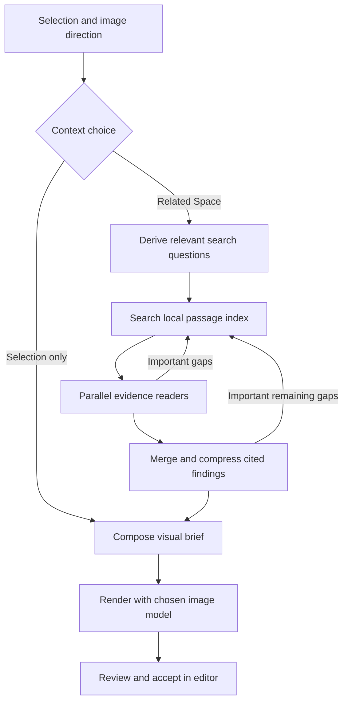

# Adaptive image context

Orion can illustrate a selection by finding relevant material within its active
Space. Research width follows the questions and evidence. A large Space does not
cause a planner to receive every note or an arbitrary first sixteen notes.

## User controls

The image composer separates two choices:

| Choice | Behaviour |
| --- | --- |
| Fast | Render with `gpt-image-2.5-flare`. |
| Detailed | Render with `gpt-image-2.5-sunburst`; the default. |
| Selection only | Compose from the highlighted passage and optional visual direction. No title or surrounding Space material is sent. |
| Related Space | Search relevant passages in the current Space and use exact supporting evidence. |

Context initially follows the existing AI-context preference. Explicitly choosing
Related Space grants access for that captured image request without changing the
global setting. Rendering always requires an OpenAI key; research and composition
use the selected Intelligence provider and its key. Model labels describe the
intended tradeoff, not a guaranteed latency or price.

## Data flow

Search queries are generated from the selection, title, optional direction and
captured live surroundings. No note directory is supplied first. Local search
ranks exact passages using term rarity, phrase matches, headings, titles, aliases
and associated concepts. This is lexical retrieval with model-assisted query
expansion, not embedding retrieval. It can miss paraphrases with little shared
vocabulary; future retrieval improvements should be evaluated against examples.

Readers receive only retrieved passages. Their compressed findings must identify
exact supplied evidence IDs, and the host rejects unknown references. Mergers and
the final composer receive the cited original passages alongside those findings.
These checks establish traceability; they cannot prove that every model
interpretation is factually correct. Uncertainty and disagreements remain part of
the planning instructions.

The final image model receives the exact selection, visual direction and composed
brief. Research stages cannot edit notes, call tools, fetch URLs or cross Spaces.
All note/source/model text is untrusted data. Only acceptance writes an image into
the document, through the existing image-validation and single-Undo flow.

## Adaptive work and bounds

- At most three evidence readers run concurrently under the shared provider
  scheduler. Search and readers can propose independent questions or refinements.
- Repeated queries continue beyond previously read ranges. Distinct questions
  may use the same passage without counting it twice against the evidence budget.
- Reader admission reserves enough calls to reduce its findings. The reservation
  accounts for bounded Unicode summaries, reference IDs and refinement queries;
  merge groups depend on the actual serialized packet size.
- Each attempt allows up to 18 research calls and four minutes of research.
  Distinct evidence is capped at 64,000 serialized UTF-8 bytes / 96 passages;
  every planning request is capped at 256,000 bytes. These are safety ceilings,
  not quantities to fill. Each reader starts with up to 8,000 characters.
- Branches can refine through three levels. A merge may request an additional
  round when a meaningful cross-branch gap remains and the budget permits it.
- Search/read/merge use Low reasoning with the selected model. Composition uses
  the selected effort with 120 seconds, or 240 for High/Extra high/Max. Research
  calls have up to 90 seconds within the total research deadline.
- Local indexing yields to the UI and is cancellable. Unchanged records reuse
  their tokenization. Pathological record, passage and token ceilings sample
  across the material and explicitly mark incomplete coverage.

At a resource ceiling, Orion can finish from collected evidence and disclose
partial context. Provider errors or timeouts preserve successful checkpoints for
an explicit Retry. They do not silently render an image after failed planning.
No related matches means composition uses the selection without inventing context.

## Recovery and privacy

One captured editor request owns an in-memory `ImageGenerationSession`:

| Failure or action | Recovery |
| --- | --- |
| One reader fails | Retain successful siblings; Retry resumes missing work. |
| Merge or composition fails | Retain earlier findings and successful merges. |
| Image rendering fails | Retain the finished brief. |
| Inserting the image fails | Restore downloaded image bytes; do not render again. |
| Regenerate a successful preview | Keep the brief and explicitly request another render. |
| Cancel, discard, acceptance or editor teardown | Clear the session and ignore late results. |
| Origin, Space, AI settings or used evidence changes | Reject stale results; start fresh context on retry. |
| Unrelated note changes | Retain valid evidence and completed work. |

Checkpoints expire after twenty minutes and do not survive application restart.
They are not saved in the vault. Local timing and failure-kind diagnostics contain
no note text or keys. Progress displays research, reading, merging, composition
and rendering, without claiming a percentage of the whole Space was read.

## Verification

Maintained tests exercise exact offsets, Unicode limits, large/late relevant
passages, 100/1,000-note Spaces, overlapping questions, adaptive fan-out and
compression, partial coverage, malformed references, cancellation, stale evidence,
scope isolation and retries after research, render and insertion failures.
Native tests additionally exercise provider deadline/cancellation behaviour.

These are deterministic tests with synthetic data and mocked providers. Actual
provider latency, image quality and retrieval recall need separate live evaluation;
passing tests does not establish those outcomes.
